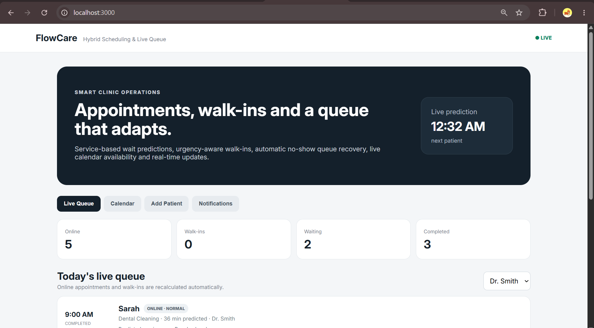
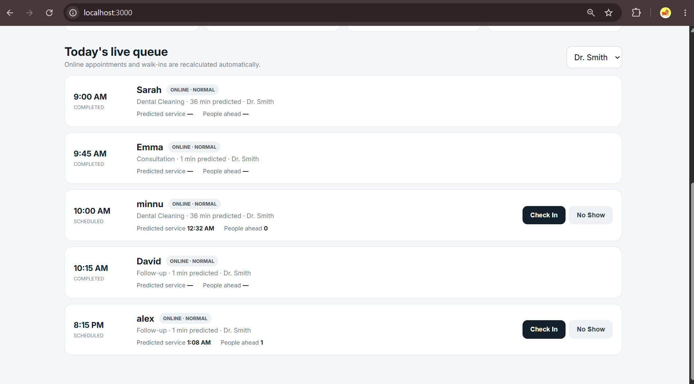
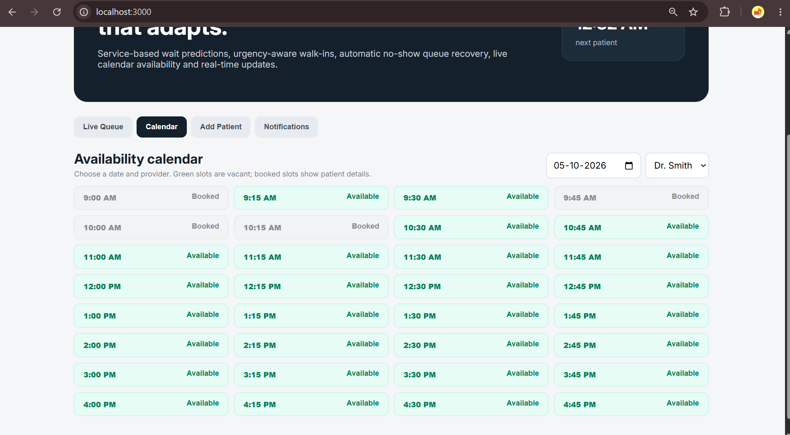
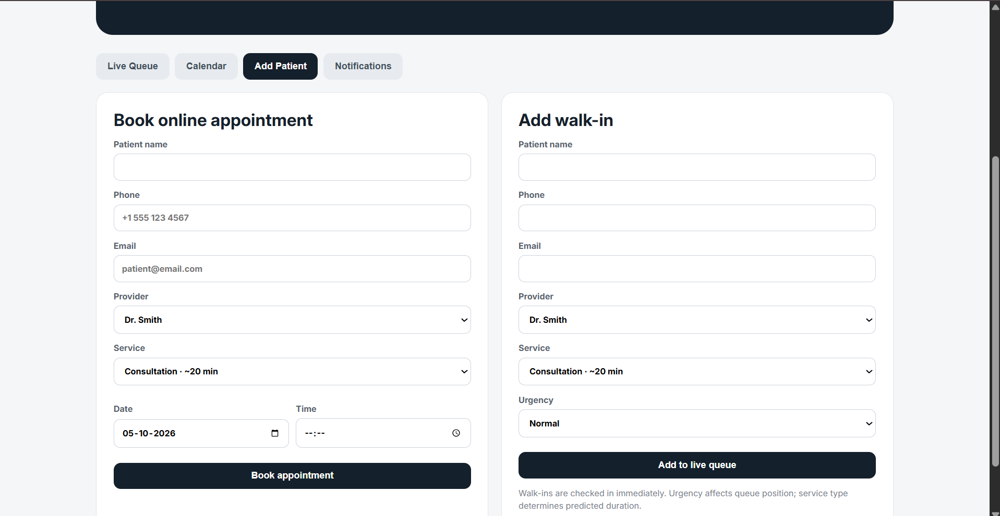
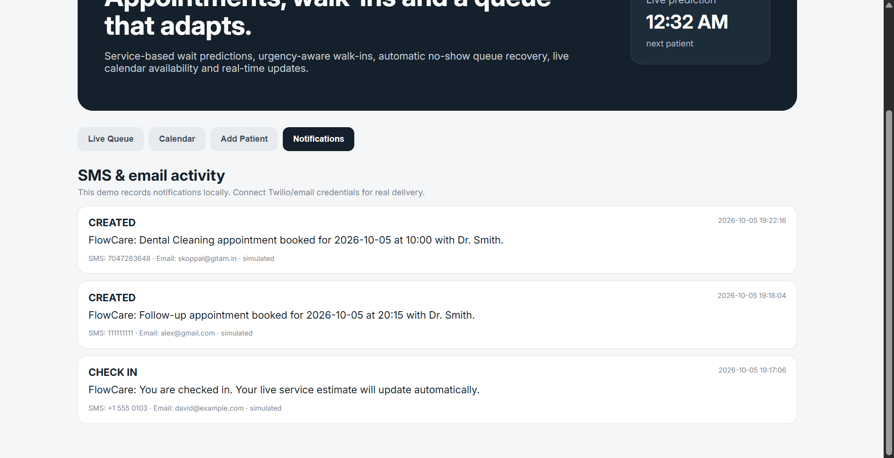

# FlowCare Smart Scheduling

A portfolio-ready clinic scheduling prototype combining online appointments and walk-ins in one live queue.

## Included
- Online appointment booking and 15-minute slot availability calendar
- Walk-in scheduling with Normal / Priority / Urgent levels
- Service-based predicted duration and live predicted service time
- Start / Complete workflow; completed services feed future duration estimates
- 15-minute-before online check-in rule
- No Show button with automatic queue recovery: the next checked-in/waiting patient becomes next and receives a notification
- Real-time WebSocket refresh across open dashboards
- SMS/email notification event log (simulated by default)
- Reschedule API and Swagger docs

## Run on Windows
Backend terminal:

    cd backend
    python -m venv venv
    venv\Scripts\activate
    pip install -r requirements.txt
    uvicorn app.main:app --reload

Frontend terminal (from project root):

    cd frontend
    python -m http.server 3000

Open http://localhost:3000 and API docs at http://localhost:8000/docs
### FlowCare Interface

### Live Queue Management

### Appointment & Walk-In Management

### Service Availability Calendar

### Queue & Scheduling Features

## Important demo note
SMS and email are intentionally simulated so the project runs without paid credentials. `/api/notifications` shows every message that would be sent. For production, connect Twilio (SMS) and an email provider in the `notification()` function and store credentials in `.env`.

## Production upgrade path
Move the in-memory data to PostgreSQL/SQLAlchemy, add JWT roles (patient/receptionist/provider/admin), use Redis for background notification jobs, and train/evaluate a regression model once sufficient real service-duration history exists. Until then, the transparent predictor uses historical average duration by provider + service, with service defaults as fallback.
